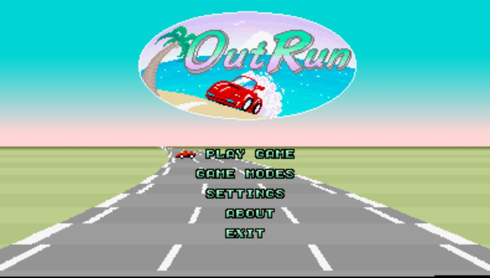

Overview
=====
This is my Vita and Switch port of Cannonball, an enhanced Outrun engine by djyt.

Thanks djyt for writing such a great program and making sure it is easily portable.

Thanks to ScHlAuChi for testing.

Thanks to my Patreon supporters: Andyways, CountDuckula, Matthew Machnee and Sean Ritzo.

NOTE: Arcade roms for Outrun Version B are required to run this engine. The roms are NOT included in the download (see installation instructions).



A detailed Manual and FAQ are here:
https://github.com/djyt/cannonball/wiki

Switch Installation Instructions
=====
Arcade roms from Outrun version B are required to run this homebrew, they are not included.

- Extract the contents of cannonball_switch.zip into the folder `switch/` on your sdcard. You should have a folder `switch/Cannonball_Switch/`.
- Obtain the arcade roms for Outrun Version B and extract them into `switch/Cannonball_Switch/roms`
- Launch the .nro file using your favorite homebrew launcher, enjoy Outrun in almost perfect 60 fps.
- This version of Cannonball is called "Cannonball_Switch" to distinguish it from Lantus' port

Switch Controls
=====
Note: Buttons can be re-mapped in menu  

Minus = insert coin  
Plus = start  
Y = gas / OK in menu
B = brake
X = change gears  
L = change in-game camera   
R = menu
Dpad = menu navigation and digital steering wheel controls  
Left stick = analog steering wheel if analog is set to ON or WHEEL ONLY, otherwise this is digital.
Right stick = analog gas/brake if analog is set to ON  

Vita Installation Instructions
=====
Arcade roms from Outrun version B are required to run this homebrew, they are not included.

- Install the .vpk
- Extract the contents of data.zip into ux0:data/ (it is just two folders and an info file for roms)
- Obtain the arcade roms for Outrun Version B and extract them into ux0:data/cannonball/roms
- Launch the bubble, enjoy Outrun in almost perfect 60 fps.

Vita Controls
=====
Note: Buttons can be re-mapped in menu  

L = insert coin  
Square = start  
Triangle = gas / enter letter on hi-score screen  
Circle = brake  
Cross = change gears  
Select = change in-game camera   
R = menu
Dpad = menu navigation and digital steering wheel controls  
Left stick = analog steering wheel if analog is set to ON or WHEEL ONLY, otherwise this is digital.  
Right stick = analog gas/brake if analog is set to ON  

Notes about Vita version
=====
- Default difficulty is set to easy, but can be changed to normal or hard in the menu.
- The game runs at full speed with almost constant 60 fps. The exception is some slowdown at the beginning of the race. That slowdown can also be eliminated by turning of widescreen mode in the menu, but then the picture is a bit smaller. The high-resolution hack should not be enabled, it causes too much slow-down.

Rom names
======
````
-------------------------------------------------------------------------------
Place OutRun Revision B ROMs in this directory.
They must be named as follows:
-------------------------------------------------------------------------------
epr-10187.88
epr-10327a.76
epr-10328a.75
epr-10329a.58
epr-10330a.57
epr-10380b.133
epr-10381a.132
epr-10382b.118
epr-10383b.117
mpr-10371.9
mpr-10372.13
mpr-10373.10
mpr-10374.14
mpr-10375.11
mpr-10376.15
mpr-10377.12
mpr-10378.16
opr-10185.11
opr-10186.47
opr-10188.71
opr-10189.70
opr-10190.69
opr-10191.68
opr-10192.67
opr-10193.66
opr-10230.104
opr-10231.103
opr-10232.102
opr-10266.101
opr-10267.100
opr-10268.99

-------------------------------------------------------------------------------
The original Japanese release of OutRun featured slightly different tracks 
and course ordering.

Optionally, you can include the following files from the Japanese version to
play these alternate tracks:
-------------------------------------------------------------------------------

epr-10380.133
epr-10382.118
epr-10381.132
epr-10383.117
epr-10327.76
epr-10329.58
epr-10328.75
epr-10330.57

-------------------------------------------------------------------------------
Fixed Audio Rom (Optional)
http://reassembler.blogspot.co.uk/2013/01/outrun-original-game-shipped-with.html
-------------------------------------------------------------------------------

opr-10188.71f
````

Build Instructions
=====
Cannonball needs some boost header-only libraries. To prepare compilation:
- Download and extract boost_1_66_0.zip from [here](https://dl.bintray.com/boostorg/release/1.66.0/source/boost_1_66_0.zip)
- copy the subfolder boost from that archive to $VITASDK/arm-vita-eabi/include/boost for Vita, or to $DEVKITPRO/portlibs/switch/include/boost for Switch
- you should now have a file $VITASDK/arm-vita-eabi/include/boost/version.hpp, or $DEVKITPRO/portlibs/switch/include/boos/version.hpp and hundreds of other Boost header files.
- Now that boost is installed, proceed to compile cannonball:
````
cd cannonball
mkdir build
cd build
````
and then 
````
cmake -DBUILD_PSP2=ON -DCMAKE_BUILD_TYPE=Release ../cmake
make Cannonball.vpk -j10
````
for Vita, or 
````
cmake -DBUILD_NX=ON -DCMAKE_BUILD_TYPE=Release ../cmake
make Cannonball_Switch.zip -j10
````
for Switch.

Note: The Vita source depends on FrangarCJ's Vita2d fbo branch with shader support here: https://github.com/Cpasjuste/vita2dlib/tree/fbo
and FrangarCJ's vita-shader-collection gtu branch here: https://github.com/frangarcj/vita-shader-collection/tree/gtu
Those are both included as binaries and linked automatically.

Changelog
=====
1.06switch

- recompiled with 9.0.0 support

1.05switch

- added Switch release

1.05

- dpad works now if analog="off"
- gas/brake on right stick if analog="on" (digital gas/brake on buttons if analog="wheel only")

1.04

- better image quality (less blurry)
- support non-fullscreen modes

1.03

- moved menu navigation to the dpad. True analog steering wheel control can now be enabled in the controls menu, and the menu can still be navigated afterwards.

1.02

- removed unneccessary temporary files (__MACOSX, .DS_Store) from data.zip 

1.01

- forgot to include config.xml in data.zip, it is now included

1.0

- Initial Vita release
